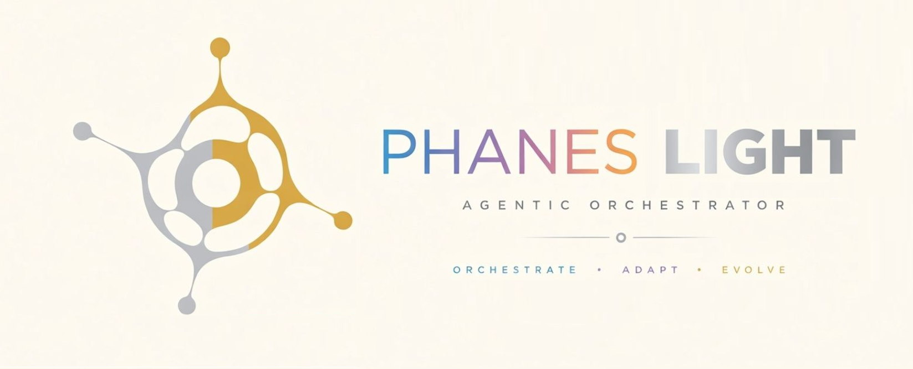

<p align="center">
  
</p>

# PhanesLight

**One command turns a repository into a wired, multi-agent development environment for [Claude Code](https://claude.com/claude-code).**

You install a single Markdown file as your `/phaneslight` command. Running it surveys your project and builds the rest inside your repository: five sub-agents, enforcement hooks, a documentation tree and a script library.

It is not install-once-and-forget. Re-run it whenever the project moves and it surveys again, upgrades the agents, and fills in what is missing. The team grows with your codebase instead of rotting beside it.

| Your situation | What to use |
| --- | --- |
| New project, or one with no PhanesLight yet | `/phaneslight` |
| A project on an older PhanesLight or Phanes | `/phaneslightupgrade` |

**Run both on Opus 5 at `high` effort.** They build and maintain the whole setup, so they are the runs worth spending on. The team they install is designed for Sonnet 5, which is what keeps a Max 5x plan viable.

**Contents** · [What it does](#what-it-does) · [The five agents](#the-five-agents) · [Which model for which run](#which-model-for-which-run) · [How to use](#how-to-use) · [Core principles](#core-principles) · [Starting from zero](#starting-from-zero) · [How to install](#how-to-install) · [Upgrading](#upgrading-an-older-install) · [Companion tools](#companion-tools) · [Version](#version) · [License](#license)

---

## What it does

**Checks itself, then your project.** The run compares its own version against the published one and offers the upgrade if you are behind. It installs four MCP servers (`context7` for library docs, `deepwiki` for dependency answers, `semble` for code search, `serena` for symbol navigation) and only four, because every tool schema costs context in every session. A failed install becomes a TODO and the run continues. It asks your consent once and remembers your answer.

**Reads the repository** to work out its purpose, language, build system and module boundaries, ignoring vendored dependencies and demo content.

**Builds the memory your agents work against:**

- **`documentation/`** for session summaries, plans, architecture snapshots and a curated API registry. Every folder gets a generated `_index.md`, so agents find things by descending indexes instead of reading the tree.
- **`tests/`** with `unit/`, `integration/`, `e2e/`, `fixtures/`, `helpers/`.
- **`.phaneslight/scripts/`**, the library that owns every mechanical rule. On both platforms as of v3.8.0.
- **`.claude/settings.json`** hooks that enforce rules at the harness layer: one blocking guard that denies an unstamped new file, one advisory check that runs size and documentation audits on every write. Prompts forget under context pressure. Hooks cannot.

**Sorts every task into a tier.** T1 is a single-file fix, T2 a feature inside one module, T3 cross-module. Each loads different context, but disclosure is universal: even a T1 fix is named in a report. A task that outgrows its tier stops and asks.

**Writes a bootstrap summary** recording the install, module list, roster and any deferred TODOs.

> **Restart your Claude Code session after the first run.** Hooks are read at session start, so they arm on the next one.

---

## The five agents

Always the same five, named by model tier. Domain expertise is injected per task rather than baked into an agent file, so the always-on context cost stays fixed as your project grows.

| Agent | Model | What it is for |
| --- | --- | --- |
| `<slug>-orchestrator` | Opus 5 | Authors, applies and dispatches. The main executor. |
| `<slug>-reviewer` | Fable 5.1 | HIGH and CRIT findings, plus the plan review at launch. Writes plans, never code. |
| `<slug>-worker` | Sonnet 5 | The default tier for authored code, inside a dispatched scope. |
| `<slug>-mechanic` | Haiku 4.5 | Mechanical non-code transforms, doc indexing, fetch-and-digest retrieval. |
| `<slug>-closure` | Sonnet 5 | Independent re-derivation at every close. Its output is a flag, never a fix. |

The expensive tier stays affordable because it is rare: the orchestrator handles MED itself, and only an undeferred HIGH or CRIT reaches Fable.

Only two agents can spawn, the orchestrator and the reviewer. That is what bounds the system to three levels.

```text
                                  YOU
                                   │
                     a task, or a plan of steps
                                   ▼
   ╭─────────────────────────────────────────────────────────────────╮
   │ <slug>-orchestrator                                       opus  │
   │ the only agent that both decides and applies                    │
   │ writes anywhere · spawns all four · holds the run's context     │
   ╰──┬──────────────┬───────────────┬───────────────────┬───────────╯
      │ a composed   │ a composed    │ a HIGH or CRIT    │ "this step is
      │ brief: scope,│ brief: fetch  │ it chose not      │  applied.
      │ conventions, │ this, digest  │ to defer          │  verify it"
      │ acceptance   │ it            │                   │
      ▼              ▼               ▼                   ▼
 ╭──────────╮  ╭───────────╮  ╭─────────────╮  ╭────────────────────╮
 │ -worker  │  │ -mechanic │  │  -reviewer  │  │      -closure      │
 │  sonnet  │  │   haiku   │  │    fable    │  │       sonnet       │
 ├──────────┤  ├───────────┤  ├─────────────┤  ├────────────────────┤
 │ authored │  │ mechanical│  │ plans the   │  │ re-derives from    │
 │ code,    │  │ transforms│  │ fix and     │  │ source: registry,  │
 │ inside   │  │ and bulky │  │ hands it    │  │ api-diff, and it   │
 │ its own  │  │ retrieval │  │ back        │  │ re-runs the build  │
 │ scope    │  │           │  │             │  │ and tests itself   │
 ├──────────┤  ├───────────┤  ├─────────────┤  ├────────────────────┤
 │ writes   │  │ writes NO │  │ writes      │  │ writes no code,    │
 │ in scope │  │ code, ever│  │ PLANS only  │  │ ever               │
 ╰────┬─────╯  ╰─────┬─────╯  ╰──────┬───┬──╯  ╰─────────┬──────────╯
      │              │               │   │               │
      │              │               │   ╰── may spawn -worker and -mechanic
      │              │               │       for its own cheap sub-tasks
      │              │               │                   │
      ╰──────────────┴───────────────┴───────────────────╯
                               │
                               ▼
            every return goes to ITS OWN spawner, never past it,
            and is written to .phaneslight/returns/ BEFORE the
            next dispatch goes out
```

A worker spawned by the reviewer reports to the reviewer. Nobody reaches past whoever dispatched them, and nobody is forked: every spawn carries a self-contained brief rather than inheriting a parent's context.

### What happens to a finding

Work travels down with a brief. Findings travel up by severity.

```text
   CRIT · HIGH · MED   ──►  create work
   LOW  · INFO         ──►  create none. They stay in the report and are
                            never rehomed into follow-ups.

   -worker finds MED or above ─┐   stops. Does NOT attempt the fix.
   -mechanic finds LOW or above┘   (it may not write code, so it cannot
        │                           absorb even a trivial fix itself)
        ▼
   its own spawner
        │
        ▼
   -orchestrator, now holding a HIGH or CRIT
        │
        ▼   can this wait until after the run?
   ╭──────────────────────────╮   ╭──────────────────────────────────╮
   │ DEFER                    │   │ ESCALATE                         │
   │ recorded with its grade, │   │ spawn -reviewer, which plans the │
   │ its file:line and a      │   │ fix and hands the plan back      │
   │ one-line justification.  │   │               │                  │
   │ Travels in the handover  │   │               ▼                  │
   │ until closed. A deferred │   │ -orchestrator applies it. The    │
   │ CRIT is named in the     │   │ reviewer never touches source.   │
   │ handover's first line.   │   ╰──────────────────────────────────╯
   ╰──────────────────────────╯
                                    MED never reaches the reviewer.
                                    The orchestrator handles it, which
                                    is what keeps the costly tier rare.

   ── independently of all of the above ──────────────────────────────

   -closure runs at every phase close, every T2/T3 step close, and before
   every handover. It re-derives rather than trusting, so it catches what
   nobody reported: an undisclosed edit comes back as drift.
```

Escalating at LOW and creating work at MED are different things. The mechanic hands a LOW upward because it cannot fix anything itself; the finding still creates no work item.

**PhanesLight pays off most when you write a plan first**, as numbered steps grouped into phases, each step with a clear boundary. That is what gives the orchestrator something to route. A vague sentence still works, it just gives the machinery less to hold onto.

---

## Which model for which run

Two questions get confused. **Which model you launch the session on** changes per run. **Which model each generated agent runs on** is PhanesLight's decision, not your dial. This is about the first.

| The run | Model | Effort |
| --- | --- | --- |
| Installing, updating or upgrading | **Opus 5**, or Fable 5 if you can afford it | `high` |
| Everyday work with the installed team | **Sonnet 5**, or Opus 5 if budget allows | `high` |

```bash
claude --model opus   --effort high     # installing, updating, upgrading
claude --model sonnet --effort high     # everyday work
```

**The bootstrap runs hot because it is paid once.** It decides module boundaries and authors a whole roster, and you live inside that output for weeks. Everyday execution is the opposite: a repeated cost, multiplied by every agent in every chain.

**Fable 5 earns its price for pre-planning, and only pre-planning.** The plan is the highest-leverage thinking in the cycle, written once and inherited by every downstream agent. Drafting on Fable and executing on Sonnet is a good trade. A whole execution session on Fable is not.

**Effort is `high` everywhere and is not a dial.** It is fixed at session launch. Changing it mid-session writes to your global settings and leaks into other projects.

---

## How to use

### First run

Type `/phaneslight` in your project. Three things make it land well:

- **Start on Opus 5 at `high` effort.**
- **Give it something to read.** On an empty repository, write a `plan.md` describing what you want to build, so the setup is shaped around your intent rather than an empty folder.
- **Steer it.** Anything typed after the command takes priority over the defaults: `/phaneslight focus on the api/ module; skip pre-commit hook install`.

Restart your session when it finishes so the hooks arm.

### Re-running it

Think of it as refreshing Claude's knowledge of your project. **Launch update runs on Opus 5 too**, since they decide what your team looks like rather than using it.

A re-run measures before it rebuilds. It opens by asking what actually moved: spec version, capability census, hook table, file hashes, git history since the last run. Nothing moved and a clean worktree means it verifies instead of regenerating, which makes a habitual re-run cheap enough to be habitual.

Good moments: freely on a small project, at the start or end of a workday, and above all **before an implementation plan**. Write the plan, then run `/phaneslight` with the plan's path after the command so the team is tuned to execute exactly it.

---

## Core principles

- **Procedure in scripts, judgment in prompts, hooks at the harness layer.** Any rule a script can enforce lives in `.phaneslight/scripts/`. Mechanical rules in prompts get forgotten under context pressure. Scripts do not forget, and hooks cannot be skipped.
- **Durable returns.** Every sub-agent return is written to `.phaneslight/returns/` before the next dispatch. A return that lives only in the spawner's context dies when that context hits its ceiling, which is where runs lose their most expensive work.
- **Verification is load-bearing, not polish.** Worker dispositions are regularly overturned on review. Budget the review pass into the plan rather than the slack. A pass that finds nothing is a successful pass, never grounds for skipping the next.
- **Single writer per artifact.** Every registry file, snapshot, summary and generated index has exactly one writing agent. Many readers, one writer.
- **Every edit is disclosed.** An undisclosed edit is reported as drift.
- **Context injection over inheritance.** A sub-agent receives only the slice its tier allows, and pulls bulky material through a mechanic digest. That digest is unverified material, not a source: any fact heading into a durable document is re-derived first.
- **Bounded fan-out.** No more than five sub-agents at once, whatever the harness allows. A wider sweep is recommended to you, never quietly self-multiplied.
- **Compaction survival.** A run keeps a phase ledger on disk and resumes from it after a mid-flight death.
- **Index-first navigation.** No agent bulk-reads `documentation/`. It descends the indexes, loads the target, and reads nothing else.

---

## Starting from zero

Already using Claude Code? Skip to [How to install](#how-to-install).

**1. Create a Claude account** at [claude.ai](https://claude.ai).

**2. Get a plan that can carry it.** One task can run chains of several Claude instances. **Pro is not enough.** You want **Max 5x** as a workable entry point, **Max 20x** for headroom, or the pay-per-token [API](https://console.anthropic.com). Multi-agent work uses far more tokens than ordinary chat.

**3. Install Claude Code.**

```bash
curl -fsSL https://claude.ai/install.sh | bash          # macOS / Linux
```
```powershell
irm https://claude.ai/install.ps1 | iex                 # Windows
```

You also need `git` ([git-scm.com](https://git-scm.com)). Verify with `claude --version`.

**4. Sign in.** Run `claude` in any folder and follow the prompt. Choose **Claude account** for Max, **Anthropic Console** for API.

**5. Install PhanesLight**, below. It is two commands.

---

## How to install

### Prerequisites

- Claude Code, installed and authenticated, plus `git` and your project's own toolchain.
- On Windows, **PowerShell 5.1+** (ships with Windows). POSIX uses any standard shell.
- Recommended: `uv`, which runs the `serena` and `semble` servers. The pre-flight installs it if missing.

### Install the command

This makes `/phaneslight` available in every repository.

**Linux / macOS:**

```bash
mkdir -p ~/.claude/commands
curl -L https://raw.githubusercontent.com/Aloim/phaneslight/main/phaneslight.md \
  -o ~/.claude/commands/phaneslight.md
curl -L https://raw.githubusercontent.com/Aloim/phaneslight/main/PhanesLightUpgrade.md \
  -o ~/.claude/commands/phaneslightupgrade.md
```

**Windows (PowerShell):**

```powershell
New-Item -ItemType Directory -Force "$env:USERPROFILE\.claude\commands" | Out-Null
Invoke-WebRequest `
  -Uri https://raw.githubusercontent.com/Aloim/phaneslight/main/phaneslight.md `
  -OutFile "$env:USERPROFILE\.claude\commands\phaneslight.md"
Invoke-WebRequest `
  -Uri https://raw.githubusercontent.com/Aloim/phaneslight/main/PhanesLightUpgrade.md `
  -OutFile "$env:USERPROFILE\.claude\commands\phaneslightupgrade.md"
```

For a single project instead, use `.claude/commands/` in the repository rather than `~/.claude/commands`.

### Run it

Open the repository in Claude Code and type `/phaneslight`. The first run takes several minutes, pauses to confirm module boundaries and hook install, and ends by asking you to restart the session. Later runs are faster, and only differences are written.

### What gets created

```
your-repo/
├─ documentation/        # project memory, navigated by index, never bulk-read
│  ├─ _index.md          #   generated index (sole writer: phaneslight doc-index)
│  ├─ session-summaries/ #   SS0000N run records
│  ├─ plans/             #   dated implementation plans
│  ├─ snapshots/         #   dated architecture snapshots
│  └─ registry/          #   curated API registry (sole writer: orchestrator)
├─ tests/                # unit · integration · e2e · fixtures · helpers
├─ .phaneslight/         # scripts, config, and machine-owned state
│  ├─ scripts/           #   cli.js · anchor-check · new-file · loc-check · doc-check ·
│  │                     #   register-check · doc-index · module-list · list-apis · hook-*
│  │                     #   and, on both platforms as of v3.8.0:
│  │                     #   preflight · update-preflight · install-templates · scaffold ·
│  │                     #   ledger · manifest-write · census-diff · repo-manifest · batch-apply
│  ├─ registry/          #   generated API baseline (sole writer: closure)
│  ├─ returns/           #   durable sub-agent returns, per run
│  ├─ config.json        #   confirmed modules · language · build system
│  ├─ manifest.json      #   installed-artifact provenance and hashes
│  └─ run-progress       #   phase ledger for crash / compaction resume
├─ .claude/              # harness wiring
│  ├─ agents/            #   the five fixed agents
│  ├─ workflows/         #   YAML task sequences
│  ├─ settings.json      #   stamp-guard (blocking) + size-check (advisory) hooks
│  ├─ template/          #   fetched prompt templates
│  └─ .phaneslight       #   run counter + install-state marker (hidden)
├─ CLAUDE.md             # root: orchestration mandates; modules: local guidance
└─ CLAUDE.local.md       # live register of work in motion
```

Every script finds the project by walking up to `.phaneslight/config.json` and uses only root-relative paths, so a hook can never be wired to the wrong tree. Each one observes or writes what it is told to and decides nothing.

The shipped `.gitignore` excludes `.claude/`, `.phaneslight/` and other runtime artifacts. Adjust to taste.

---

## Upgrading an older install

Fetch `PhanesLightUpgrade.md` with the commands above, then run `/phaneslightupgrade` on **Opus 5 at `high` effort** with a clean `git status`. It performs file surgery on knowledge your project cannot re-earn, which makes it the worst run in this library to economize on.

It refreshes your `/phaneslight` command, detects the installed version, plans the jump from the changelog, and works on a dedicated `phaneslight-upgrade-<date>` branch behind an evidence-verified checklist. Knowledge is preserved byte for byte, superseded artifacts are archived rather than deleted, and you review and merge the branch yourself. Restart your session afterwards.

You normally arrive here from `/phaneslight` itself, which offers the upgrade whenever a newer version has shipped.

**From v3.7.1**, the jump is small and additive. There is no manual v3.7.2; the POSIX parity work published under that number on the plugin line is folded into v3.8.0 instead, so you go straight from v3.7.1 to v3.8.0 and skip nothing.

**From v3.6.1 or earlier**, `/phaneslightupgrade` sees a migration boundary between your version and this one and routes you through the full migration path instead of an in-place update. Same steps, longer checklist.

**Coming from the plugin?** It moved to [`Aloim/phaneslightplugin`](https://github.com/Aloim/phaneslightplugin), so a marketplace added from this repository no longer resolves. Either re-add it there (`/plugin marketplace add Aloim/phaneslightplugin`), or uninstall the plugin and install the manual command files above. If you take the manual route, run `/phaneslight` once afterwards: the plugin removed PhanesLight's hook entries from your `.claude/settings.json` when it took over registration, so nothing enforces stamp and size discipline until a manual run puts them back. Do not run both entry points at once. Your project state carries over untouched either way.

---

## Companion tools

PhanesLight stays modular: anything beyond bootstrapping ships separately. Each works standalone in any repository and snaps into PhanesLight's structures when it finds them.

- **[Charon](https://github.com/Aloim/charon)** finds dead code, unused files and duplication, then writes an evidence-backed audit without touching anything. Worth running before large refactors, since stale code is context poison for agents.
- **[Metis](https://github.com/Aloim/metis)** reads Claude Code's own transcripts and reports whether your team actually used the tools it was told to.
- **[Mosyn](https://github.com/Aloim/mosyn)** keeps a shared, disciplined project memory on decentralized storage, so a team has one durable memory across sessions and machines.
- **[Philia](https://github.com/Aloim/philia)** shares a Windows terminal in the browser for collaborative or remote vibecoding, tunneled from your own PC with nothing for guests to install.

### Third-party enhancements

PhanesLight never installs these. It discovers them only if you already have them, and wires them into exactly the agents whose duties they serve. Re-check any of them before adopting.

- **Shell-output compressors** (e.g. RTK) strip noise from build, test and git output before it reaches an agent's context, preserving errors and diffs in full.
- **Usage monitors** (e.g. claude-hud, claude-monitor) show live context fill and rate-limit forecasting alongside long runs.
- **CLAUDE.md linters** (e.g. cclint) validate generated instruction files in CI.

---

## Version

**Current: v3.8.0** (2026-09-05). Full accounting in [`Changelog.md`](Changelog.md).

**What is new:**

- **`anchor-check`**, a new command that resolves the precise pointers a plan or handover uses (a `file:line`, a block range, a measured constant) against the working tree, and names the ones that have gone stale. Advisory by default; `--strict` exits non-zero.
- **POSIX parity for the bootstrap set.** Ten commands that were Windows-only now run on macOS and Linux too, so a POSIX project gets the same mechanized run Windows has had since v3.4.
- **Consent is remembered.** The four MCP servers are recommended once. Decline, and it stays declined.
- **The Windows shared library is enforced.** `check-shared` now compares 25 regions across both platforms, and a publish guard runs it, so a drifted region refuses the release rather than shipping.
- **Publication moved.** From v3.8.0 this line publishes to `Aloim/phaneslight` alone. The legacy `Aloim/phanes` repository is frozen at v3.7.1 and receives nothing further. If you are still checking that URL, upgrade now.

Earlier releases, and the full history from v2.1 onward, are in [`Changelog.md`](Changelog.md). The last pre-ladder distribution is kept whole in [`older version/v3.4.1/`](older%20version/v3.4.1/) if you prefer the workflow it used.

---

## License

Released under **Creative Commons Attribution-NonCommercial 4.0 International** (see [`LICENSE`](LICENSE)). Free to use, share and adapt for any non-commercial purpose with attribution. For commercial terms, contact the author.

## Contributing

Issues and pull requests are welcome at [`github.com/Aloim/phaneslight`](https://github.com/Aloim/phaneslight). A substantive change to `phaneslight.md` should explain which class of failure mode it closes, because PhanesLight is a defensive document and every clause is load-bearing.
